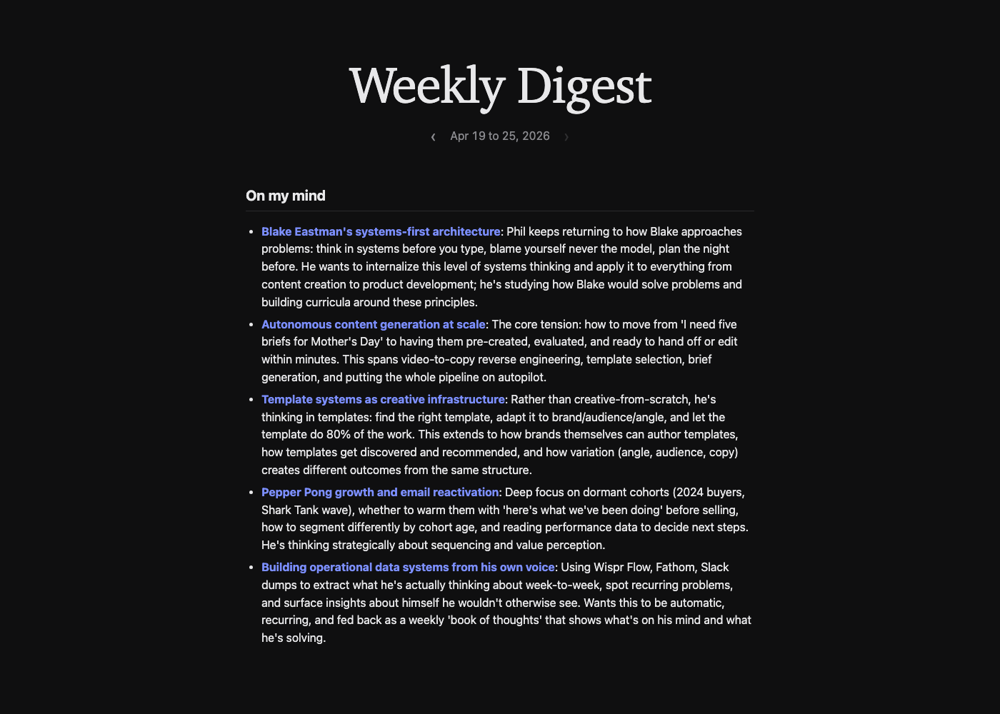

# Wispr Thoughts

> **Journal out loud.** If you don't write a daily journal but you talk while you work, this tool quietly catches everything you said, groups it by week, and shows you patterns you never noticed you were saying. It overlaps your solo voice notes with your meeting transcripts so the same idea showing up in both is highlighted automatically.



This is a self-mirror, not analytics. The system doesn't tell you what to do. It shows you what's been on your mind for eight weeks without resolution, what gets renamed every two weeks but never built, and what you keep almost-saying but never quite getting to. You read the digest once a week and decide what to do with it. **No signup, no account, no Anthropic API key, and no email setup required.** The local viewer is the primary output, and everything in the pipeline runs through your existing Claude Code subscription.

## Who this is for

- **You don't journal but you talk a lot.** Your dictation and your meetings are already capturing your thinking. This tool turns that into a weekly retrospective without asking you to write a single thing.
- **You're a heavy Wispr Flow user.** If you dictate hundreds of times a day, you're sitting on a goldmine of voiced thinking. This surfaces what's actually in it.
- **You want to recall what you were doing and what you were thinking, automatically.** No daily ritual. The corpus accumulates while you work. Sunday morning you read what your week actually was.
- **You're curious about your own blind spots.** Things you keep mentioning but never act on, ideas you've quietly renamed three times, themes that connect across solo dictation and meetings without you realizing.

## What you can do with it

1. Read what was on your mind across the entire week without ever opening a journal, because your dictation and meetings have already done the writing for you.
2. Time-travel through any past week with a calendar viewer that lets you click any day and jump to the week containing it, watching how your thinking evolved.
3. Catch the same idea showing up in solo dictation and in meetings. When something surfaces in both contexts it's almost always a load-bearing theme worth doubling down on.
4. See what you've been wrestling with for eight weeks without resolution, the stuck threads that keep getting renamed but never closed out.
5. Find the ideas you've quietly renamed three times across the year, the same underlying drive showing up under different names, so you can pick a single frame and commit to it.
6. Keep your data entirely on your machine. Nothing syncs to anyone else's cloud and there's no account to create.

## See it in 30 seconds

Before configuring anything, you can see what the digest looks like with a synthetic week (a fictional founder named Alice). No Wispr Flow, Fathom, Granola, or Claude Code subscription required.

```bash
git clone https://github.com/pvilk/wispr-thoughts.git
cd wispr-thoughts
./demo.sh
```

Your browser will open to the local HTML viewer. You should see one week (`2026-W04`, Jan 18 to Jan 24) with three themes on Alice's mind and two problems she was solving. If you see that, the pipeline is working end-to-end. Now hook up your own data.

## Quickstart with your own data

Two ways to set this up.

The first is what we recommend if you have [Claude Code](https://claude.ai/code) installed. The experience is fully conversational because Claude Code reads `CLAUDE.md` at the repo root and walks you through detection of your data sources, an optional Fathom API key, the initial exports, and the first week of theming.

```bash
cd wispr-thoughts
claude
```

The second path is the traditional shell bootstrap, which does the same work but through interactive prompts in your terminal.

```bash
cd wispr-thoughts
./bootstrap.sh
```

Either way, you end up with two commands installed in your `~/bin` directory: `viewer` to open the local digest from any terminal, and `digest` to assemble next week's edition manually. Setup takes about three minutes from a fresh clone, and there's no name or email to enter. The only credential you'll ever be asked for is a Fathom API key, and only if you actually use Fathom.

After bootstrap finishes, your viewer should already be open and showing the most recent completed week of your real corpus. If it's blank, you have no data yet for this week, that's the only legitimate failure mode and it resolves itself the next time you dictate or take a meeting.

## What you get

- **Local HTML viewer** at `http://127.0.0.1:8080` (run `viewer` from any terminal to start it). Navigate with prev/next arrows or `⌘K` jump-to-week, and a sync pill in the corner shows freshness and lets you re-pull all your data with one click. The server is bound to localhost; nothing leaves your machine. If you'd rather skip the server, `python3 src/build_viewer.py && open data/viewer/index.html` still works.
- **Consolidated weekly themes and problems** that merge your solo dictation with your meeting transcripts into a single list per week.
- **Cross-week auditor pass** that surfaces stuck threads carrying for three plus weeks, drift clusters where the same idea got renamed, avoidance patterns, novel themes appearing for the first time, and quantitative shifts in your dictation volume.
- **Time-traveled calendar navigation** so you can jump to any specific week and read what was on your mind that week, side-by-side with your meeting context.
- **Optional weekly email digest**, off by default. Flip a config flag and add a Gmail app password later if you want a Sunday-morning email instead of (or in addition to) the viewer.

## Sources you can layer on

The richer the data, the sharper the patterns. Today's digest pulls from three surfaces where working voice and meeting thought ends up: solo dictation through Wispr Flow, scheduled meetings through Fathom, and ambient meeting notes through Granola.

| Source | What it adds | Status |
|---|---|---|
| Wispr Flow | Solo voice dictation from your local SQLite | Working today |
| Fathom | Cloud-based meeting transcripts via API | Working today |
| Granola | Local Mac app's cached meetings | Working today |
| Apple Notes | Considered writing from your phone, iPad, and Mac, all converged via iCloud | Exporter ships, kept as a parallel corpus (not mixed into the digest yet) |
| Mobile Wispr | Phone dictations not synced to desktop | Investigating Wispr's data export options |
| Slack (sent only) | Your work-voice, shorter and more direct than dictation | Planned via [slackdump](https://github.com/rusq/slackdump) |
| Gmail (sent only) | Your written long-form voice in email | Planned |
| iMessage | Your closest-relationship private speech | Planned |
| Apple Calendar | What you spent time on, titles and durations only | Planned |
| Apple Voice Memos | Speech you recorded outside Wispr | Planned |
| GitHub commits | What you actually built each week | Planned |
| Notion | Your structured second-brain pages | Planned |
| Cursor / VS Code activity | When and what you worked on | Planned |

Adding a source is one Python script that produces per-day or per-meeting markdown into the `data/` directory, and the existing theme extraction and auditor passes work over whatever's there. If you want a specific source prioritized, [open an issue](https://github.com/pvilk/wispr-thoughts/issues) and tell me which one would unlock the most value for your workflow.

## Privacy

- **Everything stays on your machine** by default. Wispr SQLite, Granola data, exported Apple Notes, per-day exports, themed weeks, the assembled digest, and the local viewer all live under `data/` which is gitignored.
- **The only thing that leaves your machine is the LLM call**, which goes through your existing Claude Code subscription via the local `claude -p` command. No separate API key.
- **No account, no cloud database, no telemetry.** The repo on GitHub holds the engine, your data lives on your laptop, and if you ever want to delete everything the tool has built, you delete the `data/` directory.
- **Pre-commit hook** ships with the repo and refuses any commit containing terms from a personal denylist that lives only on your machine. Even if you accidentally paste a name or brand into a comment, the commit is blocked before it can leak.

## License

[MIT](LICENSE). Clone, fork, modify, ship.

Inspired by the data layers Wispr Flow, Fathom, and Granola already collect, the LLM heavy-lifting from Claude (Anthropic), the calendar component aesthetic from shadcn/ui, and the README structure from [slackdump](https://github.com/rusq/slackdump).
